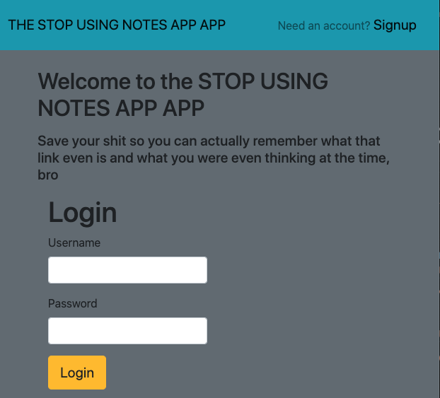
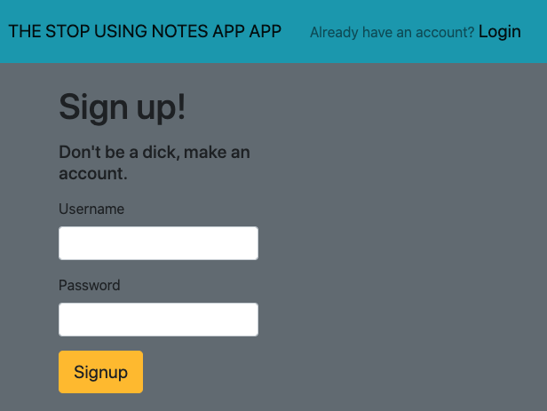
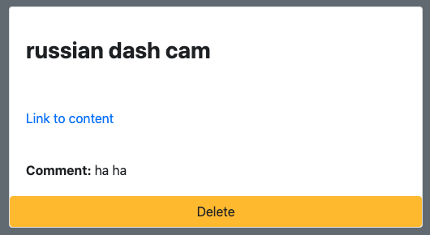
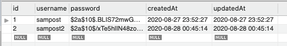
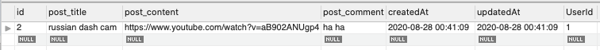

# THE STOP USING NOTES APP APP

# つな〜みh  
  
つな〜みh or The Stop Using Notes App App: Making Ideas Happen is a personalized application that allows users to bookmark links with notes. Programmers can save YouTube videos and jot down timestamps. Musicians can save music videos of songs they might want to learn later. Users will create an account and start saving posts. Because of the lack of the app's limitations, the possibilities are endless!
​
The application utilizes HTML, CSS, JavaScript, Node, Sequelize, Handlebars, and Passport.  Passport a technology that allows us to give the end users accounts that personalize the rendered products.

https://github.com/longhike/post-project
​
## Screenshots  
The login page  


The signup page  


The user's input form  


The user's post  


Database structure  


User DB (password hashed)  


Post DB  


## License
  
MIT License 
​
## Table of Contents
​
* [Installation](#Installation)  
* [Usage](#Usage)  
* [License](#License)  
* [Contribution](#Contribution)  
* [Upgrades](#Upgrades)  
* [Contact](#Contact)  
​
## Installation  
To run locally, clone the repo and run the following in your bash terminal and open your browser to localhost/8080
```bash
npm i 
```
## Usage
To use, sign up for an account and log in!  

[Deployed App](https://morning-headland-82232.herokuapp.com/)
​
## Contribution
​
Jason Sam Brandon Sid
​
## Upgrades
​
testing to be done as project moves along 
​
## Contact
For any questions and suggestions, please feel free to contact us here:
* GitHub: longhike 
​
##
MIT License 
